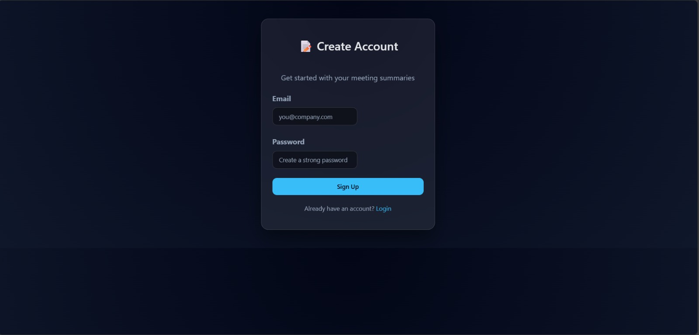
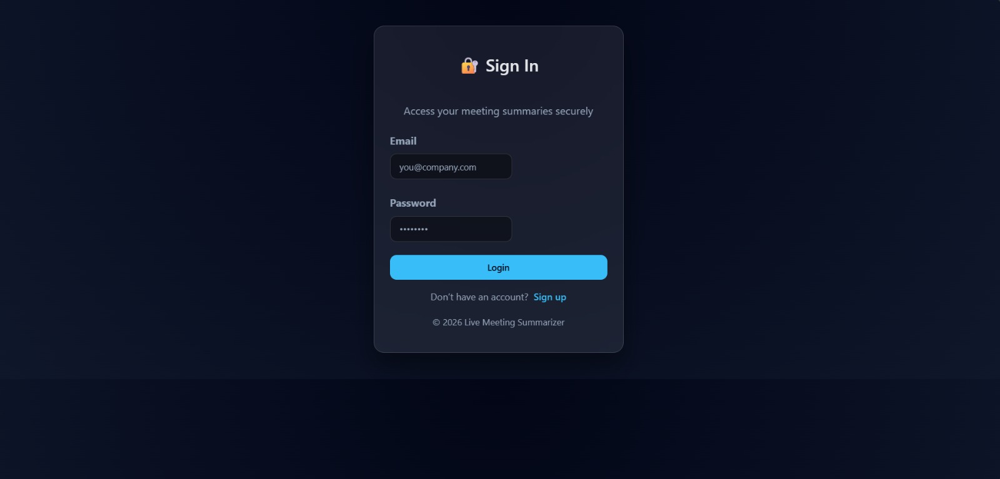
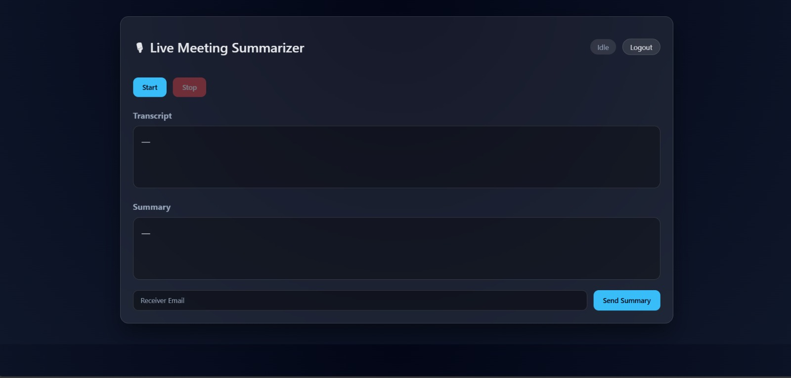
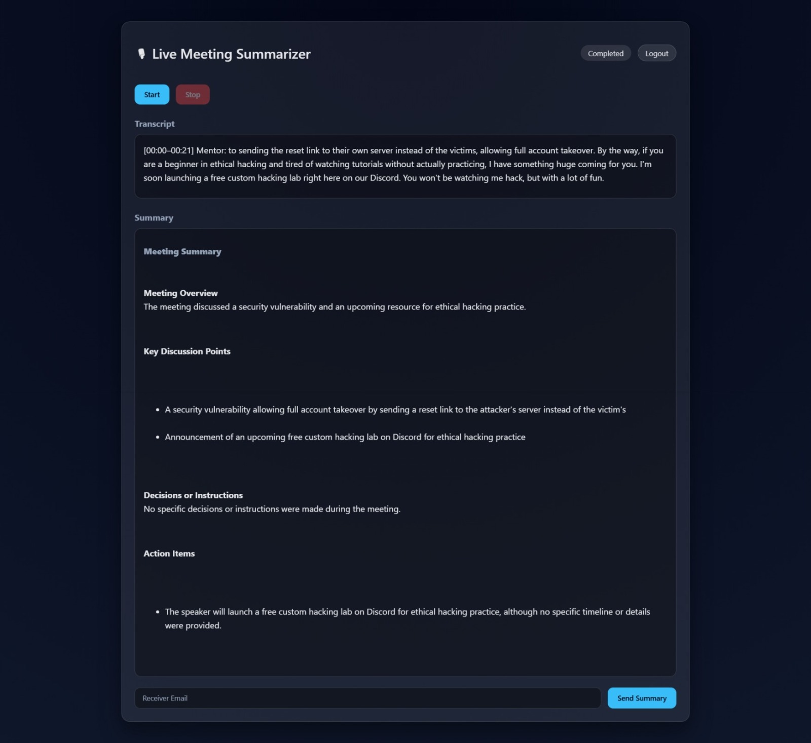

# 🎙 Live Meeting Summarizer Application

An AI-powered web application that captures live meeting audio, performs offline speech-to-text transcription, speaker diarization, and generates structured summaries using large language models — enabling fast, accurate, and secure meeting documentation.

---

## 🚀 Key Features

- 🔴 **Real-Time Audio Capture** – Start and stop meeting recording with a single click  
- 📝 **Offline Speech-to-Text (STT)** – Uses **Vosk** for privacy-preserving transcription  
- 👥 **Speaker Diarization** – Identifies multiple speakers using **pyannote.audio**  
- 🤖 **AI-Based Summarization** – Generates structured summaries using an LLM pipeline  
- 📧 **Email Delivery** – Send meeting summaries directly to stakeholders  
- 🔐 **User Authentication** – Secure login and signup system  
- 🎨 **Modern Web Interface** – Built with HTML, CSS, and JavaScript  

---

## 🧠 Problem Statement

Online meetings generate large volumes of unstructured audio.  
Manual note-taking is inefficient, error-prone, and reviewing recordings is time-consuming.

- Decisions are missed  
- Action items are lost  
- Documentation becomes inconsistent  

---

## 💡 Solution

This application automates:
- Speech transcription  
- Speaker identification  
- AI-based summarization  
- Secure distribution via email  

Result: **Improved productivity, faster decision-making, and accurate meeting documentation.**

---

## 🏗 System Architecture

[ Microphone Input ]
|
v
[ Audio Capture Module ]
|
v
[ Speech-to-Text (Vosk) ]
|
v
[ Speaker Diarization (pyannote) ]
|
v
[ LLM Summarization Pipeline ]
|
v
[ Flask Backend API ]
|
v
[ Web Frontend + Email Delivery ]


---

## 🛠 Tech Stack

### Backend
- Python
- Flask
- Vosk (Offline Speech Recognition)
- pyannote.audio (Speaker Diarization)
- HuggingFace Transformers (LLM)
- FFmpeg
- SMTP / Email Services

### Frontend
- HTML5
- CSS3
- JavaScript

---

## 📸 Application Screenshots

### Signup Page


### Login Page


### Main Interface


### Output



## 🛠 Tech Stack

### Backend
- Python
- Flask
- Vosk (Offline Speech Recognition)
- pyannote.audio (Speaker Diarization)
- HuggingFace Transformers (LLM)
- FFmpeg
- SMTP / Email Services

### Frontend
- HTML5
- CSS3
- JavaScript

## ⚙ Installation & Setup

### 1️⃣ Clone the Repository
```bash
git clone https://github.com/adarsh0014/Live-Meeting-Summarizer-Application.git
cd Live-Meeting-Summarizer-Application
```

### 2️⃣ Create Virtual Environment
```bash
python -m venv venv
```

### 3️⃣ Activate Virtual Environment
```bash
# Windows
venv\Scripts\activate

# macOS/Linux
source venv/bin/activate
```

### 4️⃣ Install Dependencies
```bash
pip install -r requirements.txt
```

### 5️⃣ Run the Application
```bash 
python appF.py
```


## 🧪 Usage Workflow

1. Sign up or log in  
2. Click **Start** to begin audio recording  
3. Conduct the meeting  
4. Click **Stop** to end recording  
5. View transcript and AI-generated summary  
6. Enter recipient email and send summary  

---

## 🔐 Security & Privacy

- Speech-to-text is performed **offline** using Vosk  
- No meeting audio is sent to cloud APIs  
- Authentication protects user data  
- Audio is processed locally with session-based access  

---

## 📈 Future Enhancements

- Real-time streaming transcription  
- PDF export of summaries  
- Cloud storage integration  
- Meeting analytics dashboard  
- Multi-language support  
